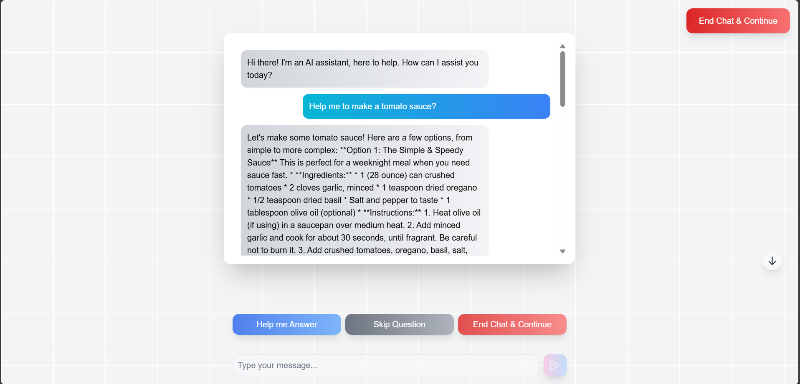

# Chatbot Web App

## Screenshot


This is a web application that allows users to interact with a chatbot powered by Google Generative AI (Gemini). The application is built using Next.js with TypeScript and styled using TailwindCSS. The deployment is done on Vercel.

## Features
- Chatbot interface powered by Google Generative AI (Gemini)
- Developed using Next.js framework with React.js and TypeScript
- Styled with TailwindCSS for a modern UI
- Hosted and deployed on Vercel

## Installation
1. Clone the repository:
   ```sh
   git clone https://github.com/your-username/your-repo.git
   ```
2. Navigate to the project directory:
   ```sh
   cd your-repo
   ```
3. Install dependencies:
   ```sh
   npm install
   ```
4. Start the development server:
   ```sh
   npm run dev
   ```


## Technologies Used
- **Frontend**: Next.js, React.js, TypeScript, TailwindCSS
- **AI Integration**: Google Generative AI (Gemini)
- **Deployment**: Vercel

## Live Demo
Check out the live version of the app: [Chatbot Web App](https://task1-gray-seven.vercel.app/)